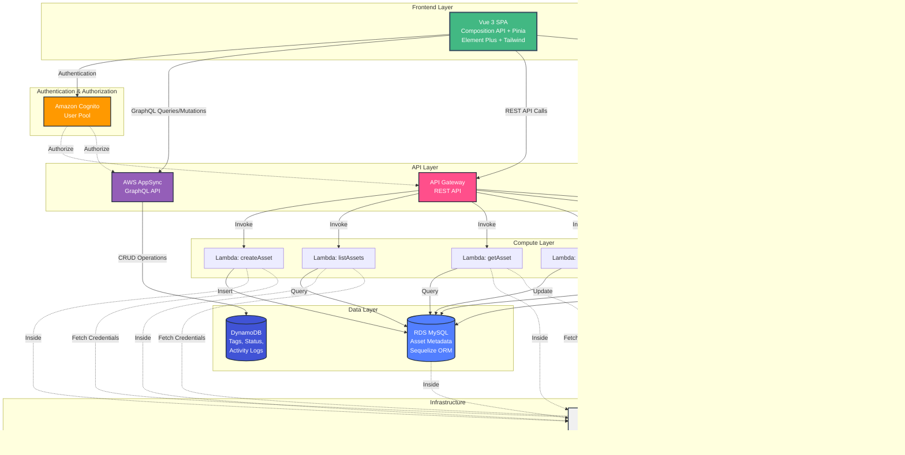

# Asset Management Application - Architecture Diagram

## System Architecture Overview

## Data Flow Architecture

## Component Architecture

## Database Schema Design

## AWS Infrastructure Diagram

## Technology Stack Summary

## Key Features Implemented

## Deployment Architecture

---

## Architecture Highlights

### 1. Dual Database Strategy
- **RDS MySQL**: Structured asset metadata requiring ACID compliance
- **DynamoDB**: Flexible, fast-access data (tags, status, logs)
- Demonstrates optimal use case for each database type

### 2. Dual API Approach
- **REST API (API Gateway + Lambda)**: Traditional CRUD operations on RDS
- **GraphQL API (AppSync)**: Real-time queries on DynamoDB
- Shows proficiency with both API paradigms

### 3. Security Best Practices
- VPC isolation for Lambda and RDS
- Secrets Manager for credential management
- Cognito JWT authentication
- S3 user-level access control
- Private subnets with VPC endpoints

### 4. Vue 3 Modern Patterns
- Composition API with `<script setup>`
- Pinia for state management
- Composables for reusable logic
- Props/Emits for component communication
- Slots for flexible layouts

### 5. Infrastructure as Code
- AWS CDK for complete infrastructure definition
- Amplify Gen 2 for simplified backend setup
- Version-controlled infrastructure
- Reproducible deployments

### 6. Scalability & Performance
- Lambda auto-scaling
- DynamoDB on-demand capacity
- S3 CDN distribution
- API Gateway caching (optional)
- Connection pooling in Lambda

---

## Cost Optimization

- **RDS**: T3.micro instance (Free Tier eligible)
- **Lambda**: Pay-per-invocation (Free Tier: 1M requests/month)
- **DynamoDB**: On-demand pricing (Free Tier: 25GB storage)
- **S3**: Standard storage (Free Tier: 5GB)
- **Cognito**: Free Tier: 50,000 MAUs
- **API Gateway**: Free Tier: 1M API calls/month

**Estimated Monthly Cost**: $10-30 for moderate usage beyond free tier
